# 🚀 Azure IAM Setup & Azure Static Web App CI/CD Deployment Guide

A comprehensive, production-grade graphical guide detailing the end-to-end setup of **Least-Privilege Identity & Access Management (IAM)** in Microsoft Entra ID and automated deployment of a **React Frontend Application** to **Azure Static Web Apps** via **GitHub Actions CI/CD**.

---

## 📊 End-to-End Architecture & Workflow

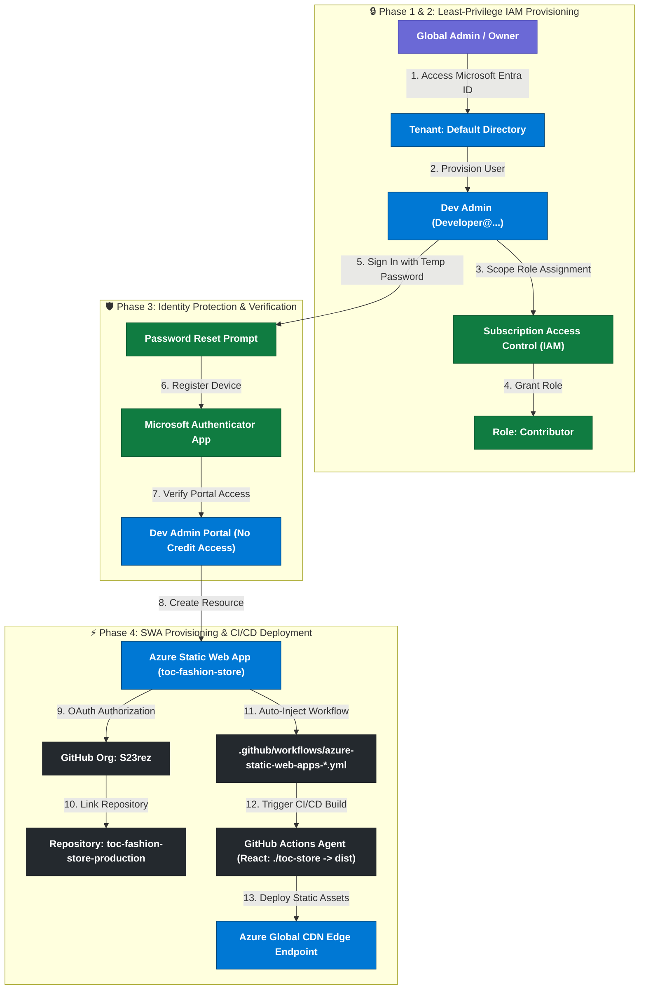

---

## 🗂️ Detailed Sequence Diagram

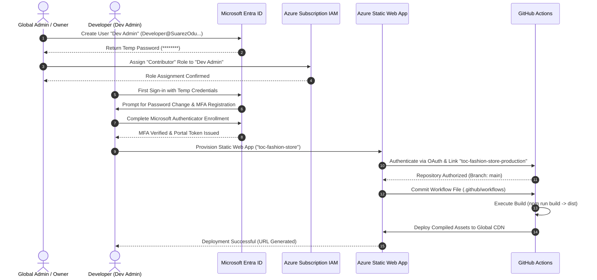

---

## 📋 Comprehensive Execution Matrix

| Step # | Phase | Operation | Component | Exact Value / Parameter                               | Security Purpose |
| :---: | :--- | :--- | :--- |:------------------------------------------------------| :--- |
| **01** | IAM Setup | Tenant Inspection | Microsoft Entra ID | Tenant ID: `xxxxxxxx-xxxx-xxxx-xxxx-xxxxxxxxxxxx`     | Verify target directory scope before changes |
| **02** | IAM Setup | User Navigation | Users Blade | `+ New user` -> `Create new user`                     | Begin non-root user creation workflow |
| **03** | IAM Setup | Identity Fields | Create User Wizard | UPN: `[Your-Domain].onmicrosoft.com`     | Create dedicated developer identity |
| **04** | IAM Setup | Review Credentials | Create User Wizard | Display Name: `Dev Admin`                             | Generate temporary credentials securely |
| **05** | IAM Scope | Subscription Review | Subscriptions | ID: `xxxxxxxx-xxxx-xxxx-xxxx-xxxxxxxxxxxx`                                                | Confirm target subscription container |
| **06** | IAM Scope | IAM Navigation | Access Control (IAM) | `Add role assignment`                                 | Initiate role delegation workflow |
| **07** | IAM Scope | Role Assignment | Add Role Assignment | Role: `Contributor`                                   | Enforce zero-billing non-root access |
| **08** | IAM Scope | Verification | Role Assignments | Scope: `This resource` (Subscription)                 | Confirm rule binding in RBAC |
| **09** | MFA | Authentication | Authenticator App | Microsoft Authenticator App linked                    | Enforce 2FA/MFA compliance |
| **10** | MFA | Access Verification | Portal Dashboard | Notice: `"You don't have permission to view credits"` | Validate least-privilege scoping working |
| **11** | Deployment | Resource Creation | Static Web Apps | Name: `toc-fashion-store`, Plan: `Free`               | Initiate global static site hosting |
| **12** | Deployment | GitHub Link | Build Config | Repo: `S23rez/toc-fashion-store-production`           | Connect source repository & branch |
| **13** | Deployment | Build Preset | Build Presets | Preset: `React`, App location: `./toc-store`          | Specify build directory and output (`dist`) |
| **14** | Deployment | Verification | Azure Deployment | Status: `Your deployment is complete`                 | CI/CD pipeline live on Azure CDN |

---

## 📸 Step-by-Step Graphical Walkthrough

### Phase 1: Least-Privilege IAM User Creation

#### Step 1: Access Microsoft Entra ID
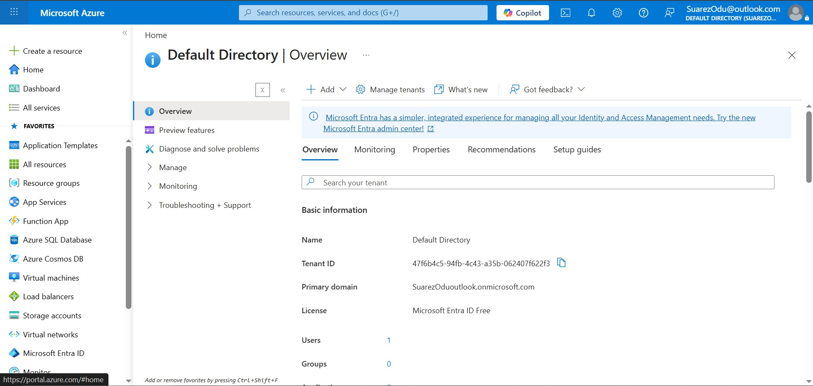
- **Directory**: `Default Directory`
- **Tenant ID**: `xxxxxxxxxxxxxxxxxxxxxxxxxxxxxxxxxxxx`
- **Primary Domain**: `[Your-Domain].onmicrosoft.com`

---

#### Step 2: Navigate to User Management
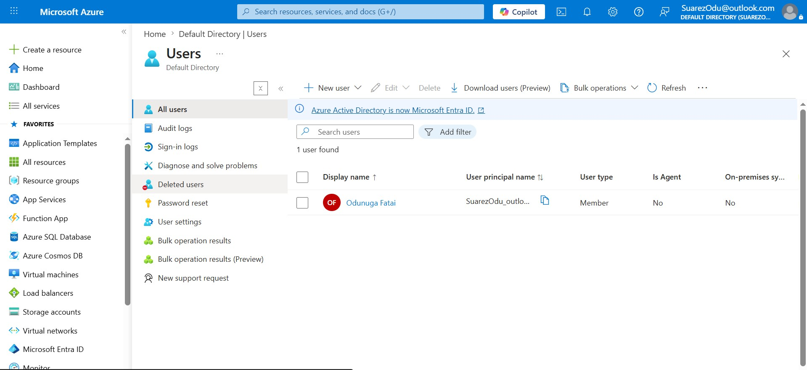
- Open the **Users** blade in Entra ID and select **+ New user** -> **Create new user**.

---

#### Step 3: Configure User Principal Name
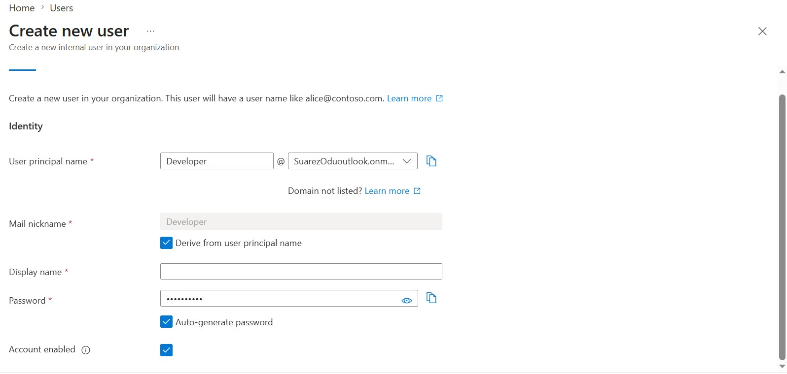
- **User principal name**: `[Your-Domain].onmicrosoft.com`
- **Mail nickname**: `Developer`
- Select **Auto-generate password** and ensure **Account enabled** is checked.

---

#### Step 4: Save Temporary Credentials & Create User
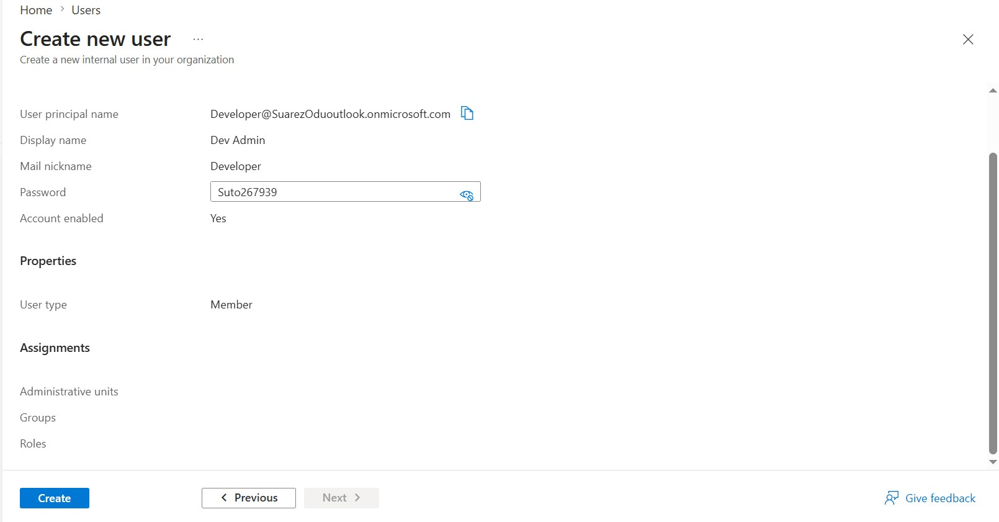
- **Display name**: `Dev Admin`
- **User type**: `Member`
- Securely copy the temporary password before clicking **Create**.

---

### Phase 2: Role Assignment & Access Control (IAM)

#### Step 5: Access Target Subscription
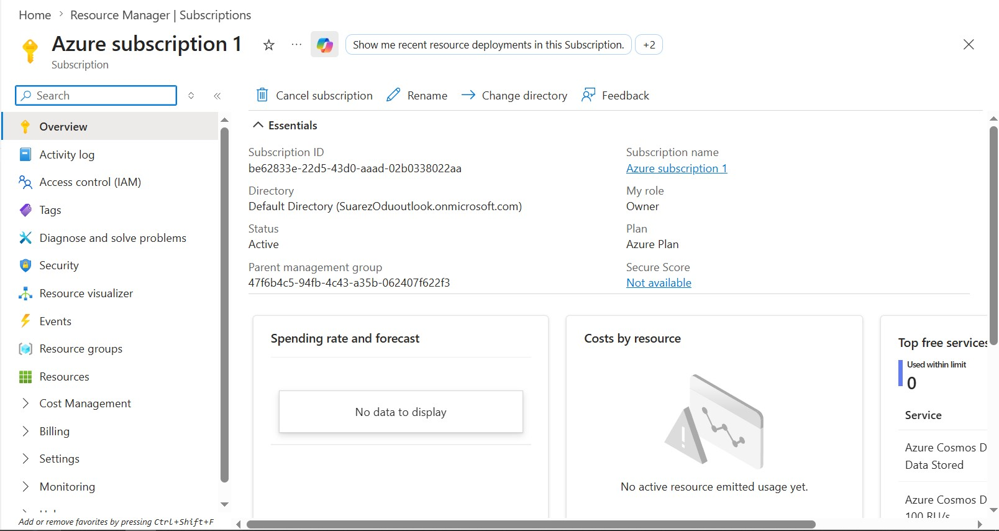
- Navigate to **Subscriptions** -> **Azure subscription 1** (`be62833e-22d5-43d0-aaad-02b0338022aa`).

---

#### Step 6: Open Access Control (IAM)
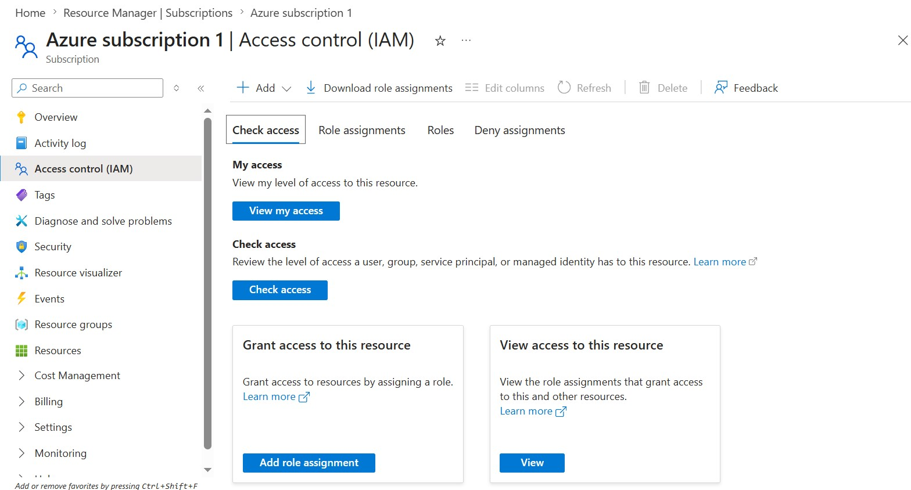
- Select **Access control (IAM)** from the subscription sidebar and click **Add role assignment**.

---

#### Step 7: Assign Contributor Role to Dev Admin
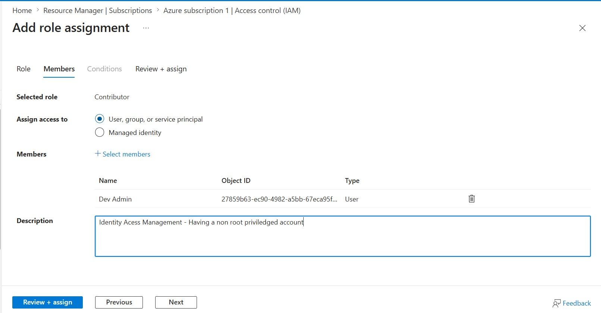
- **Role**: `Contributor`
- **Member**: `Dev Admin` (`[Your-Domain].onmicrosoft.com`)
- **Description**: `"Identity Access Management - Having a non root privileged account"`

---

#### Step 8: Confirm Role Scope
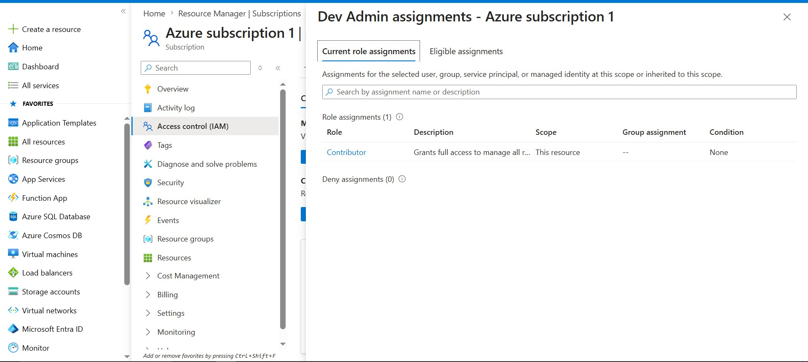
- Verify `Dev Admin` holds the `Contributor` role scoped to `This resource`.

---

### Phase 3: MFA & Identity Protection

#### Step 9: Register Microsoft Authenticator App
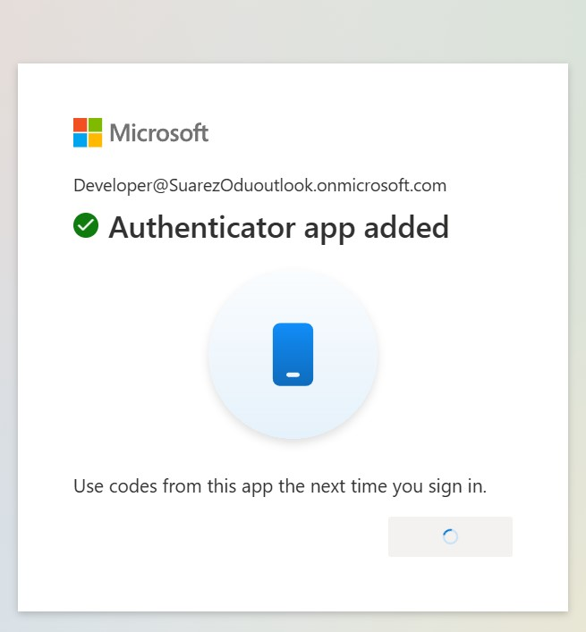
- Sign in as `Dev Admin`, change temporary password, and scan QR code with **Microsoft Authenticator**.

---

#### Step 10: Verify Least-Privilege Restricted Access
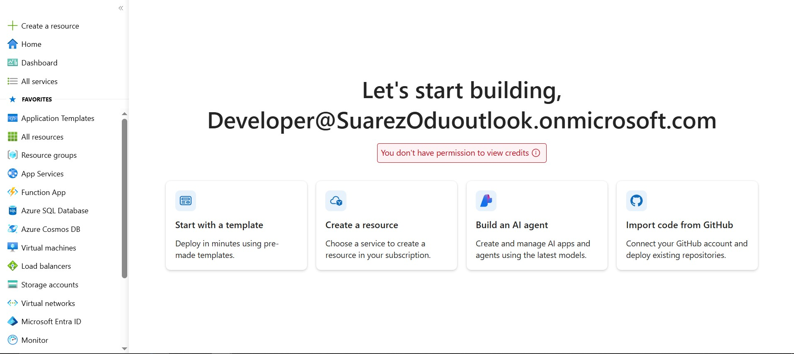
- Verify portal welcome banner and notification: *"You don't have permission to view credits"* — proving RBAC restrictions are active.

---

### Phase 4: Azure Static Web App & CI/CD Deployment

#### Step 11: Create Static Web App Resource
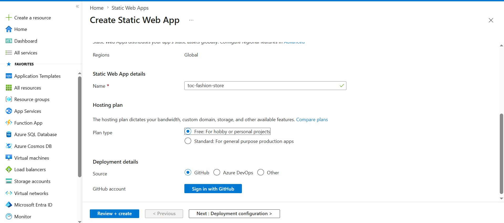
- **Resource Name**: `toc-fashion-store`
- **Region**: `Global`
- **Plan**: `Free`
- **Source**: `GitHub`

---

#### Step 12: Connect GitHub Repository & Configure Build
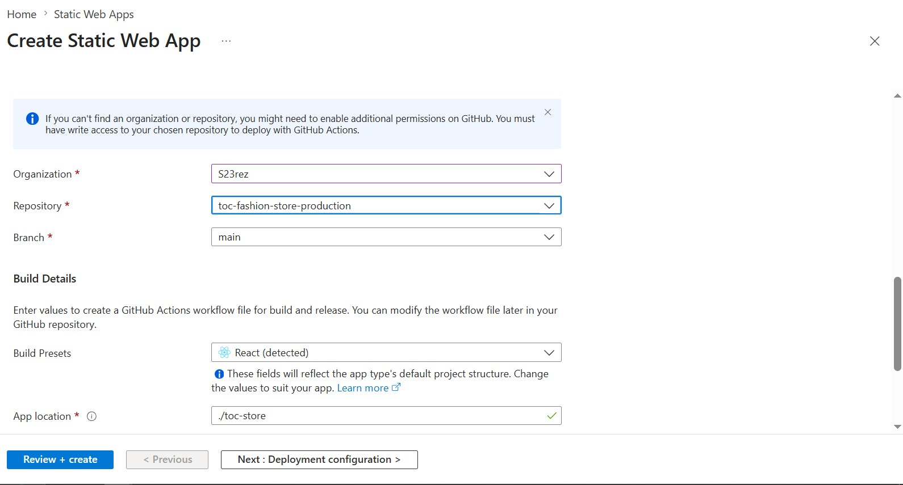
- **Organization**: `S23rez`
- **Repository**: `toc-fashion-store-production`
- **Branch**: `main`
- **Build Preset**: `React (detected)`
- **App location**: `./toc-store`

---

#### Step 13: Review & Submit Deployment
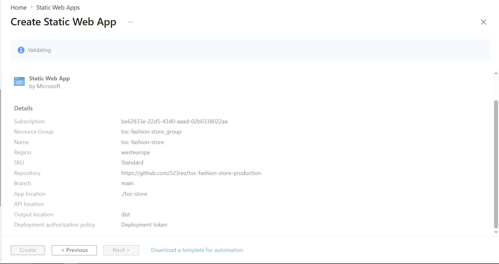
- Review validation details:
  - **Output location**: `dist`
  - **Resource Group**: `toc-fashion-store_group`
- Click **Create**.

---

#### Step 14: Deployment Complete
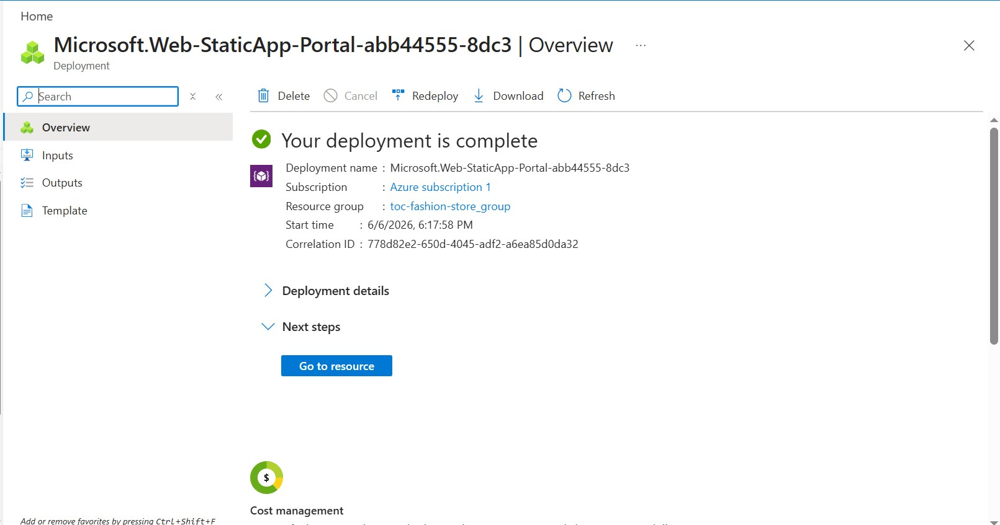
- Status: **"Your deployment is complete"**
- Azure automatically injected a GitHub Actions workflow into the repository, compiled the React application, and hosted it on Azure's global CDN.

---

## 🛡️ Security & DevOps Best Practices

> [!IMPORTANT]
> **Never use Root / Owner accounts for daily deployments.** Creating dedicated developer accounts with `Contributor` roles isolates resource management from billing and administrative operations.

> [!TIP]
> **Monorepo / Subfolder Builds**: When your frontend project lives inside a subfolder (e.g. `./toc-store`), explicitly configure `App location: ./toc-store` so the GitHub Actions runner navigates to the correct directory before executing `npm install` and `npm run build`.

> [!NOTE]
> **Automated Secret Rotation**: Azure Static Web Apps automatically generates and rotates deployment tokens stored securely inside GitHub Repository Secrets (`AZURE_STATIC_WEB_APPS_API_TOKEN_*`).

---
*Created for Azure Architecture & Deployment Documentation.*
