# Azure Windows Server 2025 Deployment & Network Security Lab (SecNet)


A comprehensive reference implementation and step-by-step documentation for deploying, configuring, securing, and remotely managing a **Windows Server 2025 Datacenter** Virtual Machine (`SecNet`) on Microsoft Azure.

---

## 📋 Table of Contents

- [Overview](#-overview)
- [Architecture & Resource Specifications](#-architecture--resource-specifications)
- [Deployment Walkthrough](#-deployment-walkthrough)
  - [Step 1: Resource Creation](#step-1-resource-creation)
  - [Step 2: Basic Configuration & Instance Details](#step-2-basic-configuration--instance-details)
  - [Step 3: Administrator Credentials & Inbound Ports](#step-3-administrator-credentials--inbound-ports)
  - [Step 4: Virtual Networking & Security Group](#step-4-virtual-networking--security-group)
  - [Step 5: Cloud Security & Defender Integration](#step-5-cloud-security--defender-integration)
  - [Step 6: Identity & Management Options](#step-6-identity--management-options)
  - [Step 7: OS Patching & Orchestration](#step-7-os-patching--orchestration)
  - [Step 8: Monitoring & Diagnostics](#step-8-monitoring--diagnostics)
  - [Step 9: Deployment Verification & Network Overview](#step-9-deployment-verification--network-overview)
  - [Step 10: Remote Desktop Authentication](#step-10-remote-desktop-authentication)
  - [Step 11: Server Manager Verification](#step-11-server-manager-verification)
- [Security Best Practices & Hardening](#-security-best-practices--hardening)
- [Quick Start Guide](#-quick-start-guide)
- [License](#-license)

---

## 🔍 Overview

This project documents the end-to-end cloud provisioning workflow of a Windows Server 2025 instance in Azure. It details the setup of isolated virtual networks, Network Security Groups (NSG), Microsoft Defender for Cloud integration, automated hotpatching, boot diagnostics, and verified Remote Desktop Protocol (RDP) management.

---

## 🏗 Architecture & Resource Specifications

| Parameter | Value / Configuration | Description |
| :--- | :--- | :--- |
| **Virtual Machine Name** | `SecNet` / `SECNET-SVR-01` | Hostname of the Azure VM instance |
| **Resource Group** | `SecNet_RG` | Logical container for VM and associated resources |
| **Region** | `West US 2` | Azure deployment region |
| **Operating System** | `Windows Server 2025 Datacenter: Azure Edition - x64 Gen2` | Next-gen enterprise server OS image |
| **Security Type** | `Trusted Launch` | Secure Boot & vTPM enabled infrastructure |
| **Virtual Network (VNet)** | `SecNet-vnet` | Isolated cloud network address space |
| **Subnet** | `default (10.0.0.0/24)` | Primary internal IP range |
| **Private IP Address** | `10.0.0.4` | Dynamic internal network allocation |
| **Public IP Address** | `20.109.133.234` (`SecNet-ip`) | Internet-facing IP endpoint |
| **NIC Security Group** | `Basic` | Inbound firewall control |
| **Allowed Inbound Ports** | `RDP (3389)` | Remote management port |
| **Admin Username** | `s23rez` | Administrator account name |
| **Patch Management** | Hotpatching & Azure-orchestrated | Zero-reboot security patching enabled |

---

## 📸 Deployment Walkthrough

### Step 1: Resource Creation

Initiate resource provisioning by launching the **Create a resource** wizard from the Microsoft Azure Portal home dashboard.

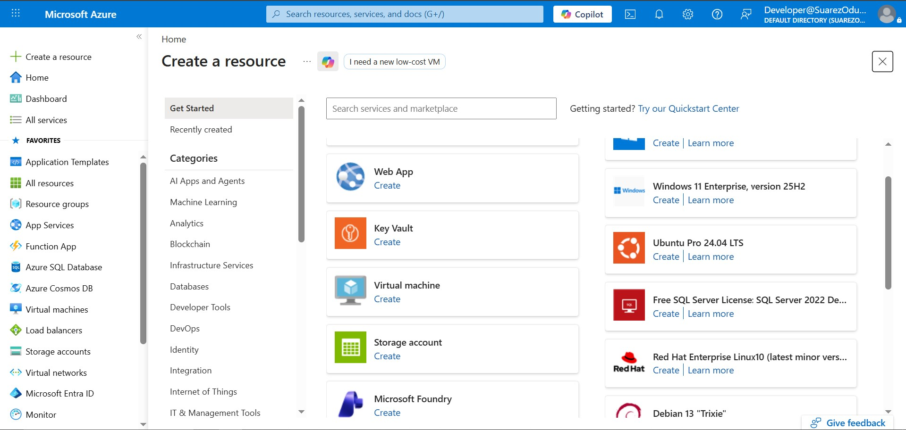

---

### Step 2: Basic Configuration & Instance Details

Configure core project details including the subscription, target resource group (`SecNet_RG`), VM name (`SecNet`), and region (`West US 2`). Select **Windows Server 2025 Datacenter: Azure Edition - x64 Gen2** with **Trusted Launch** security features.

| Basic Details | Selected Configuration |
| :--- | :--- |
| **Resource Group** | `SecNet_RG` |
| **VM Name** | `SecNet` |
| **Region** | `US West US 2` |
| **Availability Options** | No infrastructure redundancy required |
| **Security Type** | Trusted launch virtual machines |
| **Image** | Windows Server 2025 Datacenter: Azure Edition - x64 Gen2 |

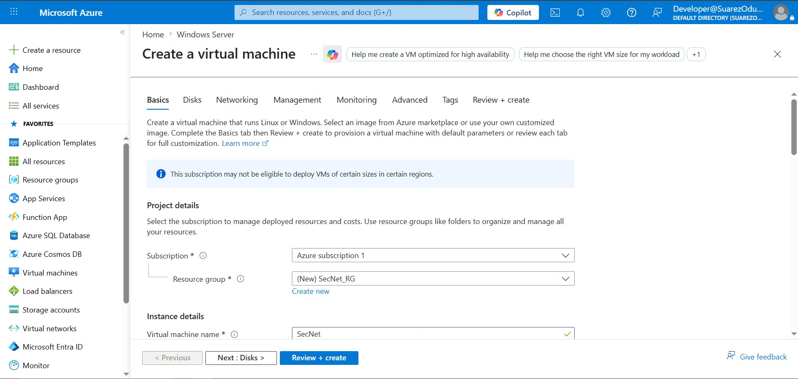
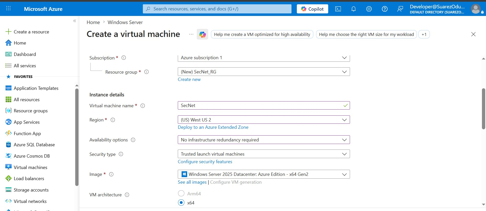

---

### Step 3: Administrator Credentials & Inbound Ports

Define local administrator credentials (`s23rez`) and configure network access policies. For remote administration, enable inbound traffic on **RDP (Port 3389)**.

> [!WARNING]
> Opening RDP (Port 3389) to all public IP addresses is suitable for lab testing. For production environments, restrict access to specific source IP ranges or utilize Azure Bastion / Just-In-Time (JIT) access.

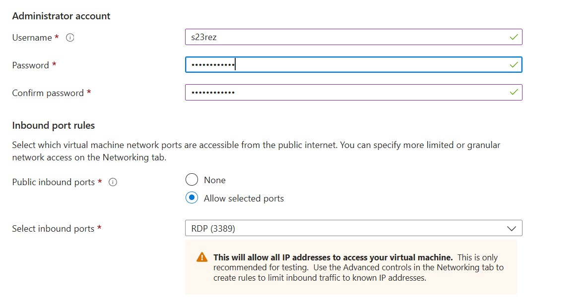

---

### Step 4: Virtual Networking & Security Group

Provision networking components to establish secure internal and external communication paths:
- **Virtual Network**: `SecNet-vnet`
- **Subnet**: `default (10.0.0.0/24)`
- **Public IP**: `SecNet-ip`
- **NIC Network Security Group**: Basic

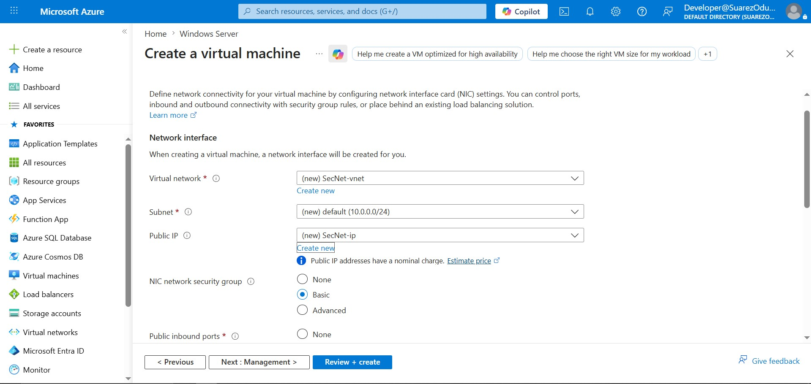

---

### Step 5: Cloud Security & Defender Integration

Enable **Microsoft Defender for Cloud** (Basic plan) to provide unified threat prevention and workload security across the virtual machine instance.

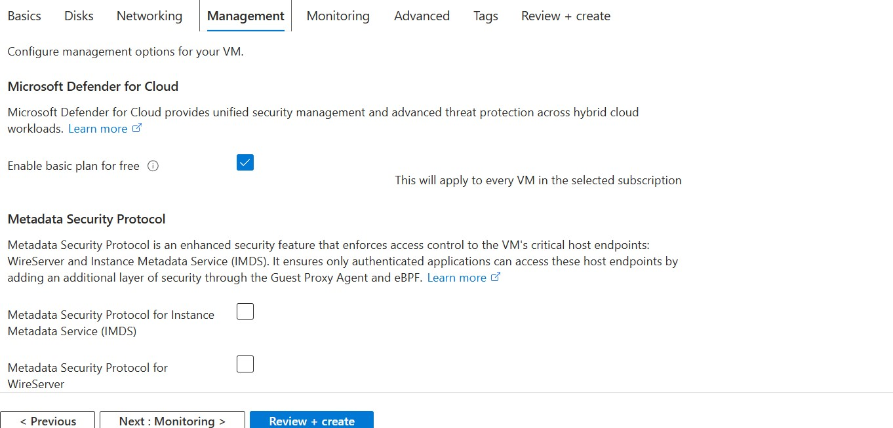

---

### Step 6: Identity & Management Options

Maintain baseline identity policies by configuring optional identity management, Microsoft Entra ID integration, and disaster recovery settings according to lab requirements.

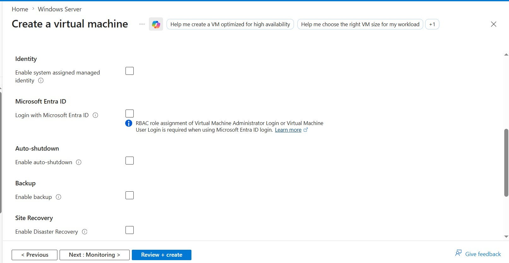

---

### Step 7: OS Patching & Orchestration

Configure Windows Server 2025 **Hotpatching** and **Azure-orchestrated patch management**. Hotpatching allows critical OS security updates to be applied without requiring system reboots.

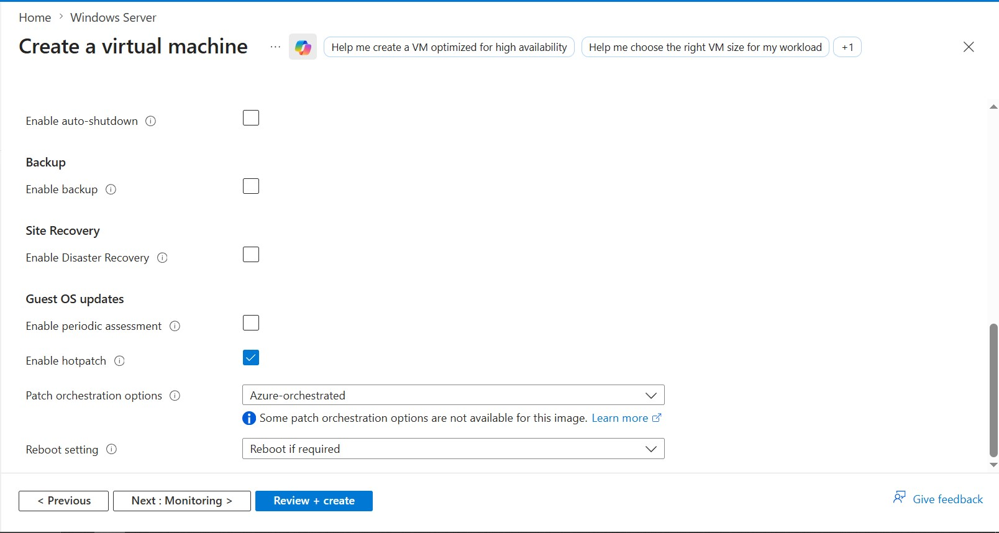

---

### Step 8: Monitoring & Diagnostics

Enable **Boot Diagnostics with a Managed Storage Account** to capture boot logs and serial console outputs, facilitating rapid troubleshooting of startup issues.

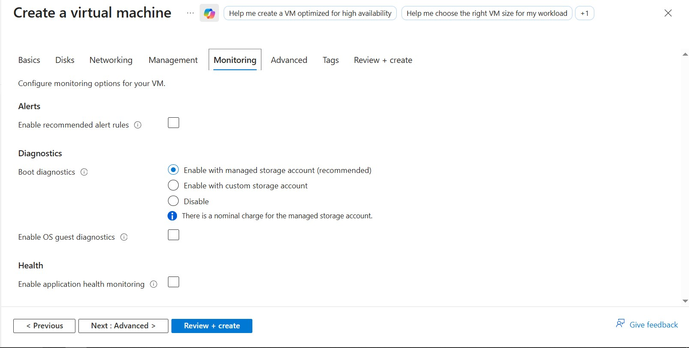

---

### Step 9: Deployment Verification & Network Overview

Once deployment finishes, navigate to the VM Overview blade to verify operational metrics and assigned network interfaces:
- **Status**: Running / Provisioned
- **Public IP**: `20.109.133.234`
- **Private IP**: `10.0.0.4`
- **Network Interface**: `secnet757`

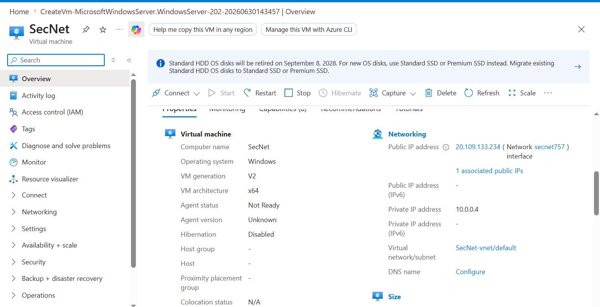

---

### Step 10: Remote Desktop Authentication

Launch a Remote Desktop Protocol (RDP) client, target the assigned public IP `20.109.133.234`, and authenticate using administrator credentials (`s23rez`).

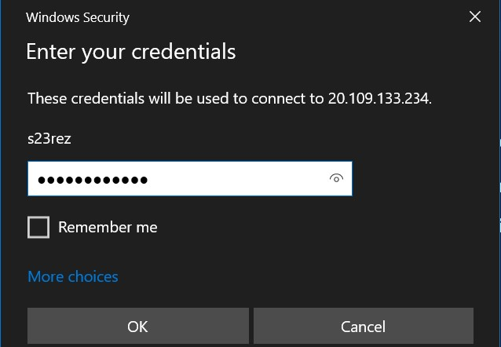

---

### Step 11: Server Manager Verification

Upon successful RDP login, open **Server Manager** inside the Windows Server 2025 instance (`SECNET-SVR-01`) to verify local network status, Remote Desktop connectivity, and Defender Firewall configurations.

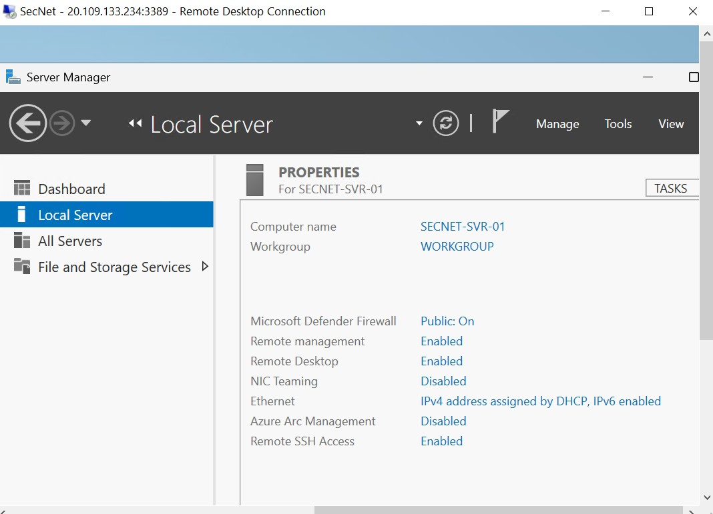

---

## 🛡 Security Best Practices & Hardening

1. **Restrict RDP Access**: Modify the Network Security Group (NSG) rule for port `3389` to restrict access solely to your authorized IP address (`Source: Custom <Your-IP>`).
2. **Implement Azure Bastion**: Replace public IP RDP access with Azure Bastion for encrypted, agentless browser-based access without public IP exposure.
3. **Store Credentials Securely**: Store admin credentials and SSH keypairs in **Azure Key Vault** rather than hardcoding or using simple passwords.
4. **Enable Network Security Group Logs**: Forward NSG flow logs and Azure Activity logs to an Azure Log Analytics workspace for SIEM monitoring.
5. **Enforce Just-In-Time (JIT) VM Access**: Utilize Microsoft Defender for Cloud JIT access to unlock inbound port 3389 only upon request and approval.

---

## 🚀 Quick Start Guide

### Connecting via RDP (Windows Command Prompt / PowerShell)

```powershell
# Connect to SecNet VM via Remote Desktop
mstsc /v:20.109.133.234
```

### Managing VM state via Azure CLI

```bash
# Start the SecNet VM
az vm start --resource-group SecNet_RG --name SecNet

# Stop & Deallocate the SecNet VM (saves compute costs)
az vm deallocate --resource-group SecNet_RG --name SecNet

# Show VM details
az vm show --resource-group SecNet_RG --name SecNet --show-details --output table
```

---

## 📄 License

This documentation and configuration repository is released under the **MIT License**.
